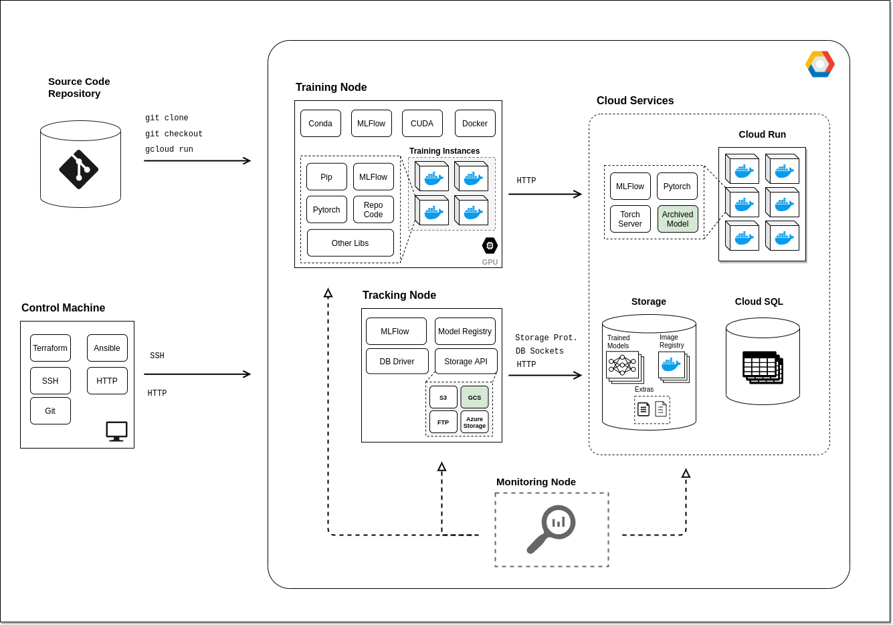
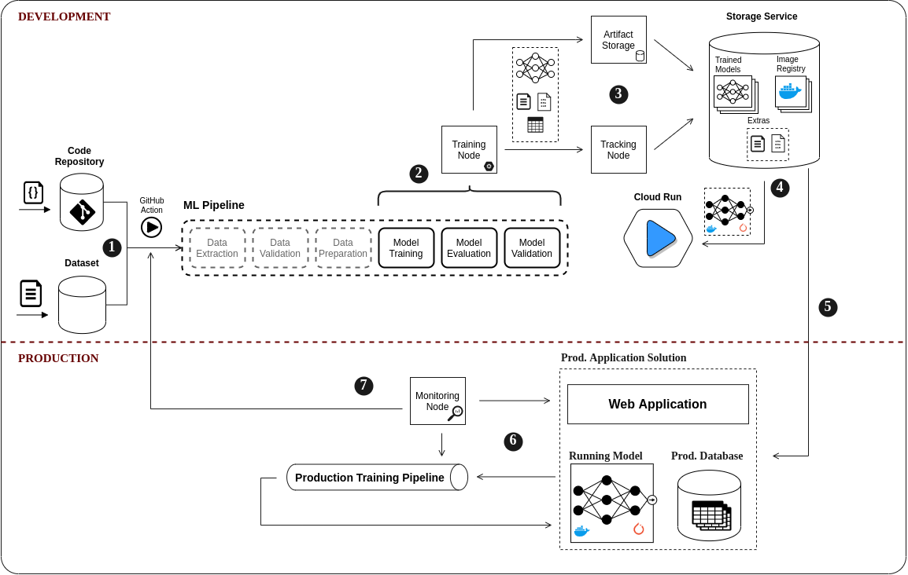

# Operationalising MLFlow: A MLOps Tale

## TL;DR;

TBD

## Introduction

The Mlops.community engineering labs were designed to allow teams explore new MLops technologies in 
a collaborative sandbox setting. The first of these labs investigated the use of MLflow to train and
deploy a PyTorch model to TorchServe. For context, MLflow is an open source platform to manage the 
ML lifecycle, including experimentation, reproducibility, deployment, and a central model registry.
PyTorch is well known as one of the two main deep learning frameworks, and TorchServe is the 
low-latency model serving framework for PyTorch.

Late last year, PyTorch and MLflow announced a complete integration which allowed 
[@MLFlowPytorch, @MLFlowPytorchIntegration]:

- Autologging for PyTorch Lightning models;
- Better model saving for PyTorch models (including TorchScript);
- A plugin to allow deployment of PyTorch models to a TorchServe server;
- Example projects to help users learn how to train and deploy PyTorch models with MLflow.

Our team had no experience with MLflow, so we were very appreciative of the example projects to get 
ourselves up to speed quickly. In fact, since we couldn’t decide on a dataset/application to build 
our project around, we decided to use the News Classification example project as the starting point 
of our project. We decided the important things for us to work on during the project were:

- Deployment to a distributed cloud infrastructure;
- Containerisation for reproducibility;
- End-to-end automation of the process.

With this in mind, we planned to take the example project and deploy it into as close to a 
production architecture as we could build in 1 month. In retrospect, what we were planning to do was
take a project that was squarely at level 0 of MLops maturity and move it towards level 1 
[@MLOpsMaturityModel].
By the end of the project, we had successfully implemented an automated training workflow in Github 
Actions using a containerised training environment, and an automated deployment of a containerised 
TorchServe server to Google Cloud Run.

SFW?

### Who we are

TBD

### MLflow&torchserve

- Where does it live
- About the example projects we used
- Bringing it to level 1 [@MLOpsMaturityModel]

## Our project

### Design decisions
#### Architectural Components and Decisions
In this section, we record the (most relevant) design decisions, components selection and the 
rationale around them.

| # | Subject | Description | Affected Items | Solution | Rationale |
|---|---------|-------------|----------------|----------|-----------|
| 1 | Computing | ML needs processing power as well as GPU. Our architecure relies on distributed elements, thus needing a reasonable number of physical or virtual machines (some with GPU-power) | All Nodes and Machines | GCP Compute Service | It provides $ 300,00 of (enough) free services and we can also spin some gpu-powered machines |
| 2 | Durable Data Storage | Every serious solution needs to store durable data | Tracking Server | Google Cloud SQL | A Postgres Database hosted by Google Cloud SQL is reliable and fast enough for our needs  |
| 3 | Large and Binary Data Storage | ML projects eventually need to store models and extra large files, This type of data doesn't fit in RDBMS | Tracking Server Artifact Store | Google Cloud Storage | Same as #1 |
| 4 | Shipment and Deployment | There are many deployable assets as well as acessory tools that need specific environment and SO libraries to run. Just installing them into a machine isn't a viable option | Training  Node Google Cloud Services | Docker | It's the _de facto_ pattern for shipping and deploying things |
| 5 | Lib Management | Python has a powerful but sometimes confusing and conflicting library ecossystem. Our components may depend on conflicting libs and that will lead to problems in Production | All Nodes and Machines | Pip | Pip is heavily used by Python community. It also work quite well with isolation provided by Docker images |
| 6 | Remote Access | Sometimes we need to issue remote commands or operate a remote machine | All Nodes and Machines | SSH | Hey... It's SSH. There's no need to rationale :-P |
| 7 | CI/CD & Workflow Management | We need to seamlessly integrate and deploy ML stuff. We also have to coordinate the process between nodes | All Items | Github Actions | We're using GitHub, it's heavily used by community and comes off-the-shelf |
| 8 | Project Metadata | We need to describe the ML Component, its structure and how it should run | Source Code Repository Training Node | MLFlow Project Definition | Non-functional Requirement we must adhere |
| 9 | ML Lifecycle Management | We must track the ML Process | All Nodes and Machines | MLFlow |  Non-functional Requirement we must adhere |
| 10 | ML Framework | We are building ML Components. Therefore, we must use a ML framework to train our models | Training Node Serving Instances | Pytorch | Non-functional Requirement we must adhere |

**Other Topics**
- Going from server to a cloud native serverless solution
- All that around tags and baselines we have discussed and which we didn't find common ground yet
- Our thoughts about how to sort out building, deploying, tagging and also choosing the best model 
  to the job;
- IaC and reproducibility;
- Lab-Ml.

### Workflows & Automation

#### Development

As you can see, the code repository is where it all starts. We're looking at this as if the 
experimentation phase has been completed and a data scientist is ready to commit their new, 
improved model.​ In step 1, Once the code is reviewed and merged to master, our automated pipeline 
takes over and in step 2 runs a training pipeline on our training node. MLflow logs all metrics and
artifacts to the tracking server here in 3​. Finally, we build a docker image containing torchserve 
and our model, ready for testing.

#### Production

So in step 4 we're taking that image and creating a new development cloud run service and deploying
it there. There we can run various acceptance tests​. Once we're happy with the model, we can create
a release on github, tagged with the model and version we want to push to production. 

In step 5 this automatically grabs the correct tagged image from the registry and deploys it to our 
production cloud run service​ Steps 6 and 7 are related to continuous training and monitoring that 
would be for future work

### Infra

Talk about infra component in src code and how we could use it to reproduce our experiments.

### Nice bits
#### Dockerisation
##### train

First, we build a base docker image with the python packages and other dependencies. This base image
crucial for consistency between the training environment and the serving environment​
Then we build the training image on top of that​
Finally we can use the same Mlflow project file but now using docker to train the model and log the 
metrics and model artifacts to MLflow

##### serve

From the same base image, we now build the deployment image. Since we’re using the same base we got 
rid of a class of problems where the models won’t deploy​
So here now as we’re building we’ve started torchserve, we’re now using the mlflow torchserve plugin
 to download the saved pytorch model and create the model archive file needed for torchserve, then 
 registering it with torchserve to create an endpoint in torchserve for that model​
We shut down torchserve, and the entrypoint we use is to start up torchserve ready to make 
predictions.​
Now this image is ready to be pushed to a docker registry, where it can be deployed anywhere to make
 predictions

##### Cloud Run

It's awesome

### Automation&Github actions

Alexey could drop some lines here.

## What did we learn

### Tecnhnical

Overall we were very impressed with the integration of MLflow and PyTorch/Torchserve. Although we 
had some difficulties in getting things started, these were mostly issues around documentation that 
can easily be fixed in the example projects. The errors during deployment were usually quite opaque 
also, but this was mostly an issue on TorchServe’s end, possibly fixable with better sanity checking
by the plugin. The payoff is huge once we were set up, with just a couple of mlflow commands 
allowing us to train a model reproducibly and deploy it to a TorchServe server.

The major struggles we had through the project were due to differences between our training and 
serving environments, in particular the python environments we had in each. We would train a model 
then try to deploy it and get different varieties of errors. We eventually discovered the problem 
was due to difficulties in deserialising the pickled pytorch model that had been uploaded to the 
registry. Pytorch recommends [@PytorchTutorial] saving the model as a state_dict rather than a 
pickled model for this very reason, and the recently released MLflow version 1.14 allows saving and 
loading state_dict versions. 
We were able to minimise the chances of problems like this by using a base docker image 
to install all common dependencies for the train and serve docker images. This was a great reminder 
though of the ever present difficulties in production ML projects caused by differences in the 
offline environment and the online environment.

We used two other tools to help in our journey toward MLops level 1 that are worth calling out, 
Github Actions for automation and Google Cloud Run for our container serving. As discussed in the 
design decisions above, GitHub Actions was the lowest friction way to add automation to our project.
Though there are tools like Kubeflow Pipelines or Airflow which would be best in class for this, we 
were able to create a relatively complex pipeline in a compact, declarative form which should be 
able to grow with this project for a long time without the overhead of the other tools. 

We were also very impressed with the ease of deployment of our serving docker image to Google Cloud 
Run. When we decided to host our serving image in this managed Kubernetes service, we set aside a 
good bit of time towards getting it working and maintaining it. We haven’t had to look at it since 
then, it scales to zero when it’s not being used and costs zero. 

### Non-technical

As a team we could easily have struggled as we were across 4 different timezones from Brazil to 
Sri Lanka, with different languages and different experiences with machine learning and software 
engineering. We were able to work well together using a lot of great tools for collaboration, our 
slack channel was a hive of activity, we had weekly zoom meetings for ideas and designing. 
We used Github PRs and issues to good effect, with great reviews. 
We followed a good iterative process too, with a viable project created at each step as we moved 
from our laptops, to the cloud, to containerised, to automated.  

## Summary
### What do we think of the tools

- We were all really impressed with MLflow as a tool generally​
    - The tracking server and registry are excellent tools. Really great when trying to decide the 
        best model to your project, tune hyperparameters or proof a concept. One can easily trace 
        back to which data or code led to a model as well​
    - Two BertNewsClassification projects in the mllflow and mlflow-torchserve repos are really well
        put together, allowed 4 people who had no MLflow experience and very little PyTorch 
        experience to get up to speed with both technologies​
- Seems like an awesome tool for level 0 teams​
- If I was starting a company from scratch, this would be a no-brainer to use to get to level 0​
- Fits well into a level 1 style workflow, though need other tools to get you there

### What do we think of the labs

- Engineering labs were a great opportunity to learn a technology that may not fit at your work​
- Great to work with a team with diverse backgrounds, we all brought a viewpoint that improved the setup​
- Will be a great learning resource for end-to-end MlOps projects

### Collaboration